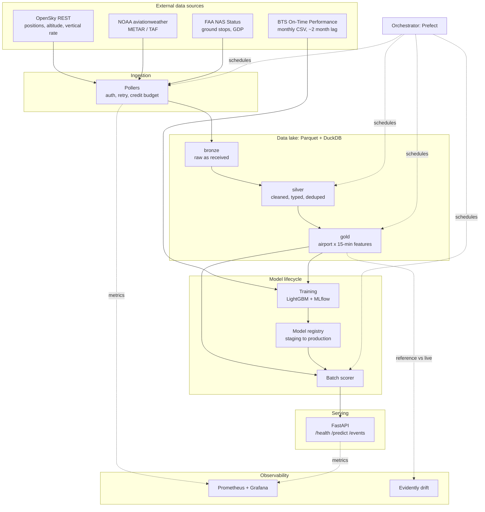
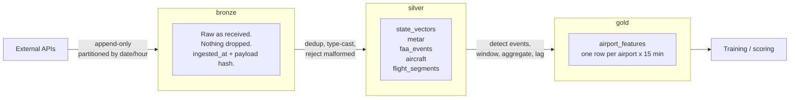
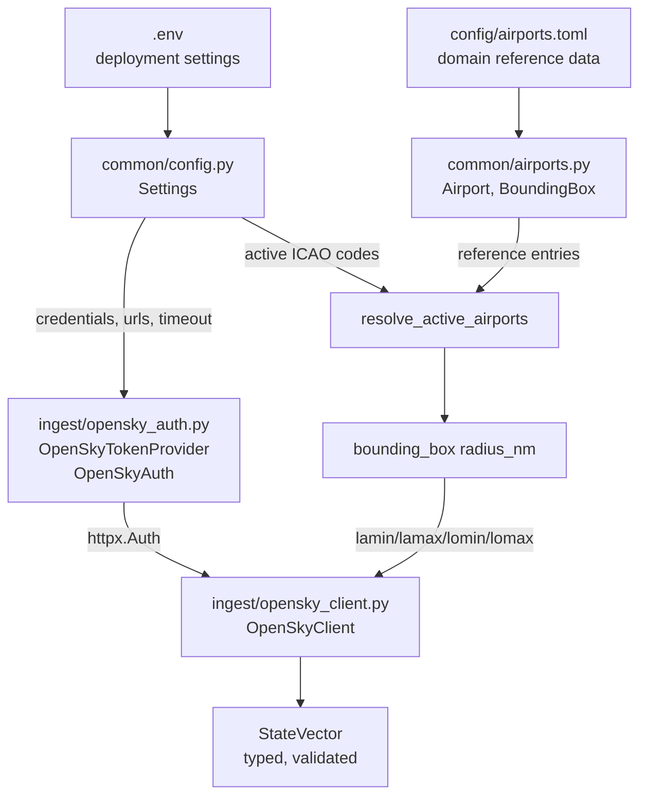
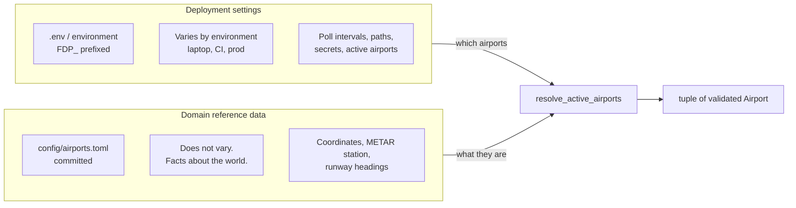
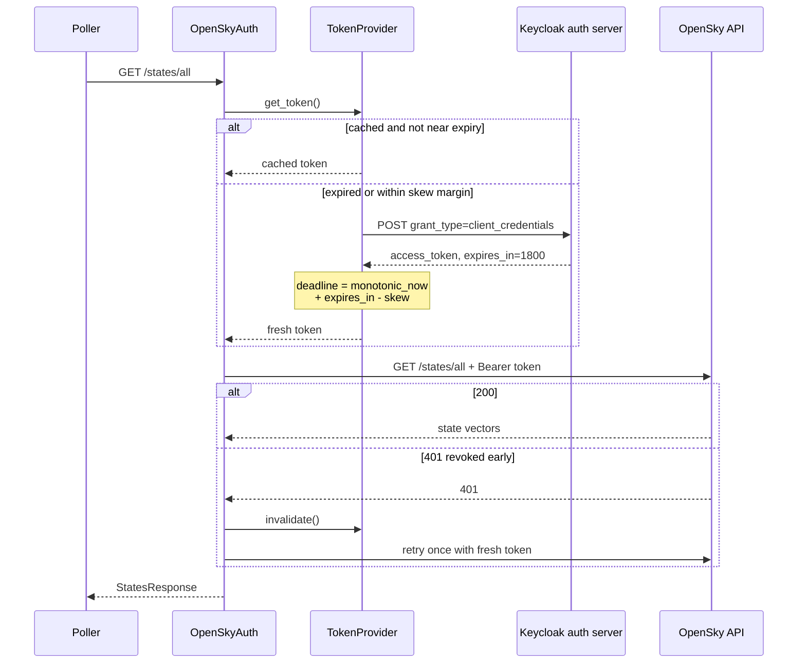
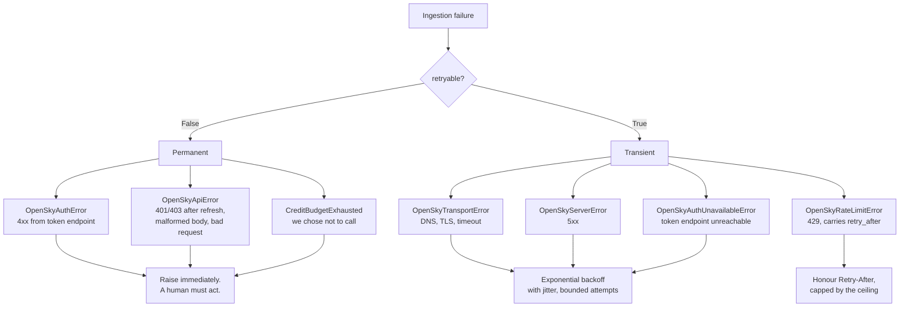
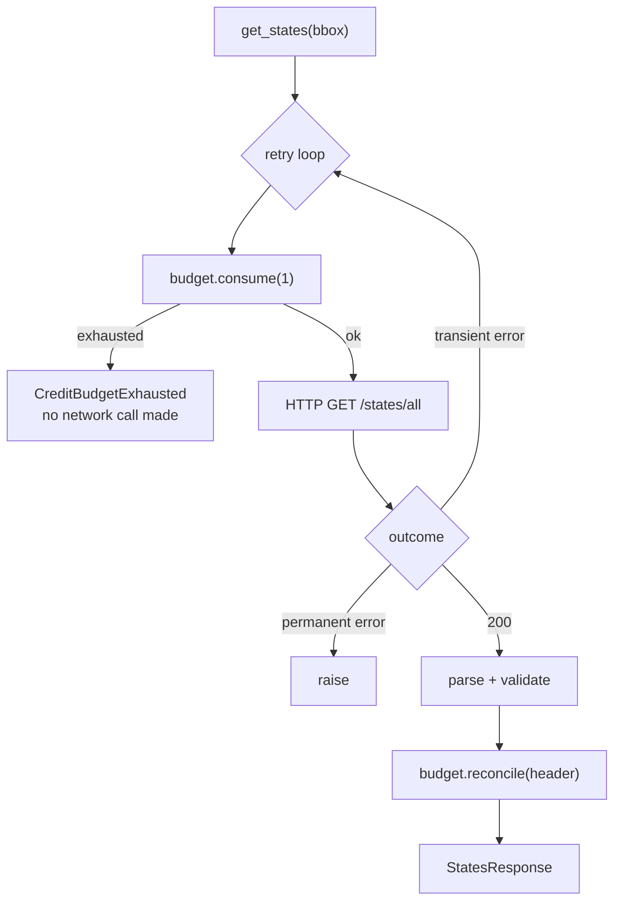
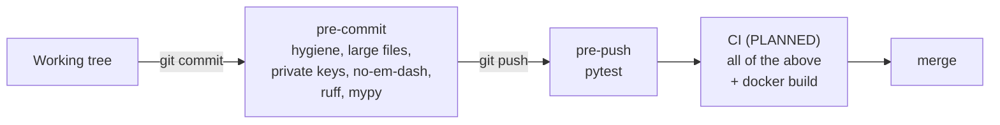

# Architecture

How this system is put together, and why it is put together that way.

> **Read this first:** this document describes both the **target** architecture
> and what is **actually built today**. The two are clearly marked throughout.
> Sections describing unbuilt components are labelled `PLANNED`. Do not mistake
> the diagrams for reality: see [Implementation status](#12-implementation-status)
> for the honest inventory.
>
> Task-level detail lives in
> [flight-delay-pipeline-plan.md](flight-delay-pipeline-plan.md). This document
> covers structure and rationale; the plan covers sequencing.

---

## 1. Tech stack

Everything the project uses, why that choice over the obvious alternative, and
whether it is in the repo today. Versions are the ones pinned in `uv.lock`,
which is the single source of version truth: hooks and CI both resolve through
it, so there is no second place for a version to drift.

### 1.1 Language and tooling

| Concern | Choice | Version | Why this one |
|---|---|---|---|
| Language | **Python** | 3.12+ | The ML ecosystem. 3.12 for PEP 695 generics and stdlib `tomllib`. |
| Packaging, envs, locking | **uv** | 0.11 | Replaces pip, pip-tools, virtualenv, and pyenv in one Rust binary. Fast enough that per-project envs stop being a chore. `uv.lock` pins the exact resolve. |
| Build backend | **hatchling** | - | Minimal PEP 517 backend. No plugins needed for a src-layout package. |

### 1.2 Runtime dependencies

| Concern | Choice | Version | Why this one |
|---|---|---|---|
| Validation, schemas, settings | **Pydantic** + **pydantic-settings** | 2.13 / 2.14 | Parsing and validation at the boundary in one declaration. Settings get the same validation as data, so a bad `.env` fails at startup, not at 3am. |
| HTTP client | **httpx** | 0.28 | Typed, explicit timeouts, and a pluggable `Auth`. Chosen over `requests` mainly for `MockTransport`, which removes the need for a separate mocking library. Used **synchronously**: 3 requests per 90 s is not a concurrency problem. |
| Retry and backoff | **tenacity** | 9.1 | Declarative retry with jitter and custom wait strategies. Its `sleep` is injectable, so the backoff schedule is asserted without a test ever sleeping. |
| Columnar storage | **pyarrow** | 25.0 | Writes the Parquet that is the data lake. Explicit schemas prevent the type drift that inferred schemas cause across files written weeks apart. |
| Structured logging | **structlog** | 26.1 | Log lines become records with fields, not sentences. Operational questions about a poller are aggregations, and those are filters, not regexes. |
| XML parsing | **defusedxml** | 0.7 | Only for the FAA feed. Stdlib `ElementTree` is documented as vulnerable to entity-expansion attacks, and that input is externally controlled. |
| Timezone database | **tzdata** | 2026.3 | Never imported by us. Windows ships no system tz database and slim containers strip it, and without one pyarrow cannot resolve even `"UTC"` when reading our own Parquet back. |

### 1.3 Standard library, used deliberately

Worth listing because in several places the stdlib was chosen *over* a
dependency, not for lack of one.

| Module | Used for | Instead of |
|---|---|---|
| `tomllib` | Reading `config/airports.toml` | PyYAML. Stdlib since 3.11, so zero dependencies, and the format is already familiar from `pyproject.toml`. |
| `hashlib.blake2b` | 128-bit content hash for deduplication | SHA-256. Hash columns are high-cardinality so Parquet cannot compress them; half the width is paid on every row forever. |
| `threading` | Locks around token refresh and the credit budget; `Event` for shutdown | Prevents a thundering herd of token requests, and lets Ctrl-C interrupt a wait immediately. |
| `time.monotonic` / `datetime` | Elapsed duration versus calendar date | Two different questions. See section 10. |
| `csv`, `uuid`, `signal`, `dataclasses` | Aircraft CSV, poll ids, graceful shutdown, value objects | - |

### 1.4 Quality tooling

| Concern | Choice | Version | Why this one |
|---|---|---|---|
| Lint + format | **ruff** | 0.16 | Replaces flake8, isort, black, pyupgrade, and bugbear with one tool. `ruff format` for formatting, `ruff check` for lint. |
| Type checking | **mypy** | 2.3 | Run in `strict` mode. Types catch the "this was a string when I thought it was a datetime" class of bug that ML pipelines hide longest, because a wrong number still looks like an answer. |
| Tests | **pytest** | 9.1 | 261 tests, no network, no sleeping, ~3.5 s. |
| Git hooks | **pre-commit** | 4.6 | pre-commit stage for hygiene and static checks, pre-push for pytest. Tools invoked via `uv run` so `uv.lock` stays the only version source. |
| Type stubs | **types-defusedxml** | - | defusedxml ships no inline types. |

### 1.5 Storage and data formats

| Layer | Format | Notes |
|---|---|---|
| bronze, silver, gold | **Parquet**, zstd-compressed | Hive-partitioned `date=/hour=`, so DuckDB reads the tree with `hive_partitioning=true` and recovers the partition keys as columns. |
| Query engine | **DuckDB** `PLANNED` | Phase 2. SQL over the Parquet tree, no server to operate. |
| Reference data | **TOML** (committed), **Parquet** (generated) | `config/airports.toml` is code-reviewed domain data; `data/reference/aircraft.parquet` is a generated lookup table. |
| Config and secrets | **`.env`** via pydantic-settings | Gitignored; `.env.example` is the committed template. |

### 1.6 External services

| Service | Auth | Format | Status |
|---|---|---|---|
| **OpenSky Network** `/states/all` | OAuth2 client credentials (Keycloak) | JSON, positional arrays | Verified live |
| **NOAA aviationweather.gov** METAR/TAF | None | JSON | Verified live |
| **FAA NAS Status** | None | XML | Closures verified live; ground stops and GDPs still unverified |
| **OpenSky aircraft database** | None | CSV snapshot | Not yet downloaded |
| **BTS On-Time Performance** | None | Monthly CSV | `PLANNED`, Phase 4 |

### 1.7 Planned, not yet in the repo

Listed so the target is visible, but none of this is installed. Each arrives in
the commit that needs it, per the just-in-time principle in section 3.

| Concern | Choice | Phase |
|---|---|---|
| SQL over Parquet | **DuckDB** | 2 |
| Batch processing of BTS history | **Apache Spark** (PySpark) | 4 |
| Dataframe validation | **pandera** | 2 |
| Gradient boosting | **LightGBM** | 4 |
| Experiment tracking, model registry | **MLflow** | 4 |
| Model serving | **FastAPI** + **uvicorn** | 5 |
| Orchestration | **Prefect** | 6 |
| Containers | **Docker** + **Compose** | 5 onward |
| CI/CD | **GitHub Actions** | 7 |
| Metrics, dashboards | **prometheus-client**, **Grafana** | 8 |
| Drift detection | **Evidently** | 8 |

**Two query engines, deliberately.** DuckDB for the pipeline, Spark confined to
the Phase 4 BTS label build. That is not an accident of drift, and the reason it
is not "just use one" is written down in decision log 35: the live path is far
too small for Spark, while Spark experience is an explicit learning goal for this
project. Confining it to one offline batch job gets the experience without
slowing the dev loop or the test suite.

Spark also needs a JVM (Java 17+ for Spark 4.x), and on Windows it needs Hadoop's
`winutils.exe` and `hadoop.dll` on a `HADOOP_HOME` path. Budget setup time for
that; it is a known rite of passage, not a sign anything is broken.

### 1.8 Entry points

| Command | Does |
|---|---|
| `uv run flight-delay-ingest` | Runs the multi-source poller (OpenSky, METAR, TAF, FAA) on per-source cadences |
| `uv run flight-delay-aircraft-db` | Downloads and rebuilds the aircraft reference table |
| `uv run pytest` | Full suite |
| `uv run pre-commit run --all-files` | Every hook against the whole repo |

---

## 2. What the system does

Ingest live flight positions and weather, detect anomalous approach patterns
(go-arounds, extended holds), and predict near-term airport delay state.

The point of the project is the **pipeline**, not the model. A notebook that
predicts delays is a different and much easier artifact. This is built as a
production-shaped system: scheduled, monitored, tested, versioned, and able to
recover from the API it depends on going down at 3am.

---

## 3. Design principles

These are the rules that decide arguments. They are listed first because most of
the specific choices later in this document follow from them.

| Principle | What it means in practice |
|---|---|
| **Simplest thing that is still production-shaped** | Parquet + DuckDB instead of a database server. Local-first, swappable later. |
| **Parse once, at the boundary** | External data becomes typed, validated objects the moment it arrives. No dict-shuffling downstream. |
| **Fail loudly at the edge, not quietly in the middle** | A malformed API response raises at ingestion, where the error names the cause, rather than surfacing later as a wrong number. |
| **Derive, do not duplicate** | Bounding boxes are computed from airport coordinates. Two stored copies of the same fact will eventually disagree. |
| **Just-in-time infrastructure** | A service arrives in the commit that needs it, not "up front". Standing up six empty containers on day one teaches nothing and debugs nothing. |
| **Constraints belong as early as possible** | Config-time beats runtime; runtime beats "discovered in the morning". |
| **No live network in tests** | Every external call is behind an injectable client. The suite runs offline and deterministically in a few seconds. Recorded real payloads sit alongside the mocks, because a mock only proves we handle the shape we believe in. |

---

## 4. System overview `TARGET`



**Stack:** Python 3.12, uv, Pydantic, httpx, Parquet + DuckDB, Prefect, LightGBM,
MLflow, FastAPI, Docker Compose, GitHub Actions, Evidently, Prometheus/Grafana.

---

## 5. Data sources and the constraint that shapes everything

| Need | Source | Notes |
|---|---|---|
| Live positions, altitude, velocity, vertical rate | OpenSky `/states/all` | OAuth2 client credentials. Daily credit budget. Bounding boxes keep cost down. |
| Aircraft type, registration, build year | OpenSky metadata CSV | Static snapshot, refreshed monthly. |
| Weather | NOAA aviationweather.gov | METAR and TAF. No key required. |
| Airport delay programs | FAA NAS Status | US only. Ground stops and GDPs. |
| Training labels | BTS On-Time Performance | Monthly CSV, published with a 1 to 2 month lag. |

**The constraint:** OpenSky provides no schedule or delay data, only what is
derivable from ADS-B. Labels therefore come from BTS, which lags by roughly two
months, while features come from live sources. Those two do not overlap until
the pipeline has been ingesting for 4 to 8 weeks.

Three consequences that shape the design:

1. Scope is limited to a few busy US airports (KJFK, KEWR, KORD) so that labels,
   weather, and live positions all cover the same ground.
2. The first model must train on weather and BTS-derivable features only.
   Trajectory features are an additive upgrade once overlap exists.
3. **Ingestion must start early and stay running.** Accumulated data is on the
   critical path, which raises the value of reliability work in Phase 1.

---

## 6. Data architecture: the medallion layers



Why three layers rather than parsing straight into features:

- **Bronze is append-only and never edited.** When a feature turns out to be
  wrong, you can recompute it from bronze. If ingestion had already dropped the
  data, it is gone permanently. The rejected rows are themselves a monitoring
  signal: a spike in malformed records means the upstream API changed.
- **Silver is where correctness lives.** Deduplication, type enforcement, schema
  validation. One place to fix a data bug.
- **Gold is modelling-ready** and nothing else reads it, so its shape can follow
  the model's needs without disturbing anything upstream.

Storage is Parquet files partitioned as
`data/{layer}/{source}/date=YYYY-MM-DD/hour=HH/*.parquet`, queried through
DuckDB. No database server to operate in v1, and the swap to Postgres or S3 does
not touch feature code.

---

## 7. Code structure

```
src/flight_delay/
  common/     config, reference data, schemas, storage IO
  ingest/     API clients and pollers          (raw data in)
  features/   trajectory + weather feature logic
  training/   dataset build, train, evaluate
  serving/    FastAPI app                       (predictions out)
config/       committed domain reference data
tests/        unit + contract tests, no live network
```

One installable package (`flight_delay.ingest`, not a bare top-level `ingest`)
so generic names cannot collide with other installed libraries.

### Current module map `BUILT`



| Module | Responsibility |
|---|---|
| [`common/config.py`](src/flight_delay/common/config.py) | `Settings`: environment-varying configuration and secrets |
| [`common/airports.py`](src/flight_delay/common/airports.py) | `Airport`, `BoundingBox`, reference loading, bbox derivation |
| [`ingest/opensky_auth.py`](src/flight_delay/ingest/opensky_auth.py) | OAuth2 client credentials, token caching and refresh |
| [`ingest/opensky_client.py`](src/flight_delay/ingest/opensky_client.py) | `/states/all` calls, positional array parsing |
| [`ingest/credit_budget.py`](src/flight_delay/ingest/credit_budget.py) | Daily credit accounting and the proactive spend gate |
| [`ingest/retry.py`](src/flight_delay/ingest/retry.py) | Backoff policy for transient failures |
| [`ingest/bronze.py`](src/flight_delay/ingest/bronze.py) | Append-only partitioned Parquet writer, content hashing |
| [`ingest/opensky_poller.py`](src/flight_delay/ingest/opensky_poller.py) | OpenSky poll function, bronze schema, row mapping |
| [`ingest/weather_client.py`](src/flight_delay/ingest/weather_client.py) | METAR and TAF from aviationweather.gov |
| [`ingest/faa_client.py`](src/flight_delay/ingest/faa_client.py) | FAA NAS status, XML parsing |
| [`ingest/aircraft_metadata.py`](src/flight_delay/ingest/aircraft_metadata.py) | Aircraft reference table (not bronze) |
| [`ingest/errors.py`](src/flight_delay/ingest/errors.py), [`ingest/http.py`](src/flight_delay/ingest/http.py) | Shared error taxonomy and status mapping |
| [`ingest/poller.py`](src/flight_delay/ingest/poller.py) | Multi-source scheduler, per-source cadences, CLI |
| [`common/logging_config.py`](src/flight_delay/common/logging_config.py) | structlog setup, stdlib logging routed through it |

---

## 8. Configuration architecture

Configuration is split into two layers because two genuinely different kinds of
data were being conflated.



KJFK's latitude is identical on your laptop, in CI, and in production. It is not
a *setting*. Forcing it through environment variables would mean encoding nested
structure as JSON in a string: unreadable, undiffable, and impossible to comment.
So it lives in version control and gets code-reviewed like source.

Precedence for settings, highest first: explicit kwargs, environment variables,
`.env` file, field defaults.

**Validation encodes domain constraints, not just types.** For example:

```python
opensky_poll_seconds: float = Field(ge=MIN_OPENSKY_POLL_SECONDS, ...)
```

That 60 second floor is the OpenSky credit budget expressed as a type
constraint. Setting it to 5 produces a startup crash rather than an exhausted
daily quota discovered the next morning.

The join between layers fails loudly: an active ICAO code with no reference
entry raises rather than being skipped. Skipping silently would produce a
pipeline that runs green while collecting nothing.

---

## 9. The ingestion path `BUILT`

### 8.1 Authentication

OpenSky issues bearer tokens valid for about 30 minutes. A poller running for
weeks needs roughly 340 refreshes per week, all unattended.



Three decisions inside that flow:

- **Refresh proactively, by a safety margin.** Waiting for a 401 costs a failed
  request on every expiry. The margin is clamped to half the token lifetime, so
  a short-lived token cannot put the deadline in the past and cause a refresh
  loop.
- **Monotonic clock, not wall clock.** Expiry is an elapsed duration. Wall clock
  jumps when NTP corrects it; a backward jump would make an expired token look
  valid and 401 every request afterward.
- **Two separate HTTP clients.** The token request goes through a client with no
  auth attached. Authenticating the token request with a token you do not have
  yet recurses forever.

### 8.2 Parsing: the most fragile point in the system

OpenSky returns each aircraft as a bare array with no field names:

```json
["3c6444","DLH9LF  ","Germany",1458564120,1458564120,6.15,50.19,9639.3,false,...]
```

Index 6 means latitude only by convention. **If a field is ever inserted
upstream, every value shifts one slot, nothing raises, and the pipeline keeps
producing confidently wrong numbers.** Models train on nonsense. Nobody finds out
for months.

The positional layout is therefore written down in exactly one place
(`_STATE_FIELDS`), converted to named fields at the boundary, and validated hard
enough that a shape change fails immediately. The `icao24` pattern
`^[0-9a-f]{6}$` is load-bearing: under a shift, position 0 becomes a callsign or
a country name and is rejected instantly.

Tolerances are asymmetric on purpose. A **shorter** array is unambiguously
broken and rejected. A **longer** one is accepted, because OpenSky appends
optional fields and refusing to ingest over a field we do not read would be
self-inflicted downtime.

---

## 10. Cross-cutting conventions

These apply everywhere and exist to prevent specific, recurring classes of bug.

### Units live in field names

`baro_altitude_m`, `velocity_ms`, `true_track_deg`. OpenSky reports SI units
while aviation thresholds are written in feet and knots. A bare `altitude`
invites comparing metres against a 1,500 ft threshold and getting a
plausible-looking wrong answer. Unit-suffixed names make the mistake visible at
the call site.

### All timestamps are timezone-aware UTC

Aircraft positions get joined against METAR observations and BTS schedules across
timezones. A naive datetime silently adopts whatever timezone the reader assumes,
and an off-by-one-hour join yields a model that looks fine and is wrong.

### Error taxonomy drives retry behaviour

Every ingestion error carries a `retryable` class flag. The retry policy reads
only that flag, so the decision lives at the raise site where the cause is
actually known. A list of retryable types maintained elsewhere drifts out of
sync silently, and it fails in both directions: transient errors stop being
retried, or bad credentials get hammered until access is suspended.



Default is non-retryable. A new error type is safe until someone deliberately
opts it in, which is the right direction to be wrong in.

### Budget and retry are separate mechanisms

Credit budgeting is **proactive**: refuse a request we cannot afford.
Retry is **reactive**: respond to a failure that already happened. Conflating
them produces a client that retries its way through a budget it already spent.



Two ordering decisions in that diagram:

- **The budget gate is inside the retry loop**, so every attempt is charged. A
  retried request costs the same as a fresh one; charging only the logical call
  would let a retry storm spend several times its share of the budget that
  exists to prevent exactly that.
- **The server's header wins over local counting.** Local counting gates the
  first request (no response has arrived yet) but drifts across restarts and
  across processes sharing one account. `X-Rate-Limit-Remaining` is
  authoritative and corrects the counter after every success.

The budget resets on the **wall clock** at UTC midnight, deliberately unlike
token expiry which uses the monotonic clock. "Has the calendar date changed" and
"how much time has elapsed" are different questions, and a monotonic counter
cannot answer the first one at all.

### Secrets

`SecretStr` for the client secret, unwrapped exactly once at the point of use.
Logs record token lifetime, never the token. Credentials escape through logs and
tracebacks far more often than through commits. `.env` is gitignored;
`.env.example` is the committed template.

### Testing

No test touches the network or sleeps. Two injection points make that possible:

- `time_source` (defaults to `time.monotonic`) lets a 30-minute expiry be tested
  in microseconds.
- `http_client` (an `httpx.Client`, mocked with `httpx.MockTransport`) answers
  requests in-process and records what was actually sent.

A test that sleeps for 1800 seconds is a test nobody runs, and a gate that never
runs is not a gate.

---

## 11. Quality gates



Hooks invoke tools through `uv run`, so `uv.lock` is the single source of version
truth. Pinning a tool separately in the hook config lets the two drift, producing
hooks that pass while CI fails on identical code.

pytest runs at **pre-push**, not pre-commit. A commit is a local checkpoint (WIP,
mid-refactor, bisect points), and gating that on a green suite pushes people
toward `--no-verify`, which disables every hook at once including the secret
scan. A push is where work becomes shared.

Pre-commit is a convenience, not a boundary: it is trivially bypassable. **CI is
the actual gate**, which is why it runs the same checks.

---

## 12. Implementation status

| Component | Status | Location |
|---|---|---|
| Repo scaffolding, uv, ruff, mypy, pytest | **Built** | `pyproject.toml` |
| Pre-commit and pre-push hooks | **Built** | `.pre-commit-config.yaml` |
| Line-ending and binary policy | **Built** | `.gitattributes` |
| Settings and secrets | **Built** | `common/config.py` |
| Airport reference data, bbox derivation | **Built** | `common/airports.py`, `config/airports.toml` |
| OpenSky OAuth2 and auto-refresh | **Built** | `ingest/opensky_auth.py` |
| OpenSky `/states/all` and typed parsing | **Built** | `ingest/opensky_client.py` |
| Credit budgeting, retry, backoff | **Built** | `ingest/credit_budget.py`, `ingest/retry.py` |
| METAR / TAF client | **Built** | `ingest/weather_client.py` |
| FAA NAS status client | **Built** | `ingest/faa_client.py` |
| Aircraft metadata | **Built** | `ingest/aircraft_metadata.py` |
| Multi-source scheduler | **Built** | `ingest/poller.py` |
| Bronze Parquet writer, content hashing | **Built** | `ingest/bronze.py` |
| Poll loop + structured logging | **Built** | `ingest/opensky_poller.py`, `common/logging_config.py` |
| Silver layer, schemas, flight segments | Planned (Phase 2) | |
| Go-around and hold detectors, gold features | Planned (Phase 3) | |
| BTS labels, training, MLflow gate | Planned (Phase 4) | |
| Batch scorer, FastAPI | Planned (Phase 5) | |
| Prefect flows | Planned (Phase 6) | |
| CI/CD | Planned (Phase 7) | |
| Prometheus, Grafana, Evidently | Planned (Phase 8) | |
| Docker Compose | Deferred by decision, returns with the first service to containerise | |

**Test suite:** 261 tests, no network, no sleeping, runs in about 3.5 seconds.

**Runnable:** `uv run flight-delay-ingest` polls the configured airports and
writes bronze Parquet. Credentials required (plan task 0.7).

**Live verification status.** Partly confirmed, and worth reading precisely:

| Source | Status |
|---|---|
| OpenSky `/states/all` | **Verified.** A real run collected 514 rows across 171 aircraft and 3 airports. |
| NOAA METAR | **Verified.** `visib` really does arrive as the string `"10+"`, and `fltCat` is present. |
| FAA closures | **Verified**, and it found a bug: the feed sends `<Start>` and `<Reopen>`, not the `<Start_Time>` and `<End_Time>` the parser assumed. Timestamps were silently None. |
| FAA ground stops and GDPs | **Unverified.** No programs were active when the feed was captured, and these are the sections the model actually needs. |
| NOAA TAF | **Unverified.** |
| OpenSky aircraft CSV, BTS | **Unverified.** Never downloaded. |

Real captured payloads live in `tests/fixtures/` and are asserted against in
`tests/test_live_fixtures.py`. Those are snapshots of one moment, not a live
check: green means "we still parse what the API sent that day", not "the API
still sends this".

---

## 13. Decision log

Decisions where the plan was changed, or where a non-obvious option was chosen.
Recorded so the reasoning survives.

| # | Decision | Rationale |
|---|---|---|
| 1 | Defer `docker-compose.yml` instead of stubbing six services in Phase 0 | Debugging empty containers with no payload teaches nothing. Infrastructure arrives with the code that needs it. |
| 2 | One installable package `flight_delay`, not bare top-level `ingest`/`common` | Generic top-level names collide with other installed libraries and make imports ambiguous. |
| 3 | Split config into `.env` and `config/airports.toml` | Deployment settings and domain facts are different things. Nested reference data in env vars is unreviewable. |
| 4 | Derive bounding boxes from coordinates, do not store them | Two stored copies of one fact drift. A bbox that no longer contains its airport looks like "the airport got quiet", not like a bug. |
| 5 | TOML for reference data, not YAML | `tomllib` is stdlib since 3.11, so zero dependencies, and the format is already familiar from `pyproject.toml`. |
| 6 | `httpx` used synchronously, not async | Three requests per 90 seconds is not a concurrency problem. Async would complicate every call site and test for no benefit. `httpx.MockTransport` also removes the need for a mocking dependency. |
| 7 | Units in field names, deviating from the plan's schema names | Metres versus feet is a real and recurring source of silent numeric error. |
| 8 | Hooks call tools via `uv run` rather than pre-commit's tool repos | One version source (`uv.lock`). Separate pins drift and desynchronise hooks from CI. |
| 9 | pytest at pre-push, not pre-commit | Preserves commits as local checkpoints and avoids training people into `--no-verify`. |
| 10 | Line endings handled by `.gitattributes`, not the linter | The hook and `core.autocrlf` were actively undoing each other. Line endings are git's concern. |
| 11 | No committed `requirements.txt` | A derived artifact that nothing regenerates goes stale and eventually installs wrong versions. Generate on demand. |
| 12 | Tolerate longer state arrays, reject shorter ones | Appended optional fields are normal upstream behaviour; refusing them is self-inflicted downtime. Short arrays are unambiguously broken. |
| 13 | `retryable` flag on the exception class, not a list of types in the retry policy | A list maintained away from the raise site drifts, and fails silently in both directions. Default False so new errors are safe until deliberately opted in. |
| 14 | Budget gate inside the retry loop, charging every attempt | Charging only the logical call lets a retry storm overspend the budget that exists to prevent it. |
| 15 | Server `X-Rate-Limit-Remaining` overrides local counting | Local counting cannot see other processes on the same account, and resets on restart. The server knows the truth. |
| 16 | Budget uses the wall clock, token expiry uses monotonic | Different questions. Date rollover is inherently wall-clock; elapsed duration must survive NTP corrections. |
| 17 | Cap `Retry-After` rather than obeying it unbounded | An absurd value would park the poller for hours. Better to fail the cycle and let the scheduler return on its own cadence. |
| 18 | Budget and retry enabled by default in `client_from_settings` | Opt-in safety means the safe configuration is the one you have to remember, and the live API is where forgetting is expensive. |
| 19 | Bronze partitioned by ingestion time, not event time | Ingestion time only moves forward, so writes never revisit a closed partition. Event time would scatter one poll across many directories and force rewrites on late data. Silver can re-partition. |
| 20 | Atomic write via temp file plus `os.replace` | A kill mid-write would otherwise leave a truncated Parquet that breaks every later read of the partition. This is what makes the restart guarantee structural. |
| 21 | Explicit pyarrow schema, never inferred | An all-null column infers a different type than a populated one, and the two files will not union. The damage appears at query time, weeks after the cause. |
| 22 | Hash excludes `ingested_at` and `airport` | Including ingestion time makes every record unique and defeats dedup entirely. Including airport stops the overlapping KJFK/KEWR boxes from collapsing to one observation. |
| 23 | blake2b-128 rather than SHA-256 for the content hash | Hash columns are high-cardinality, so dictionary encoding cannot compress them and the width is paid per row forever. 128 bits is ample at this volume. |
| 24 | `tzdata` as an explicit dependency | Python's `zoneinfo` reads the system tz database, which Windows lacks and slim containers strip. Without it pyarrow cannot resolve even "UTC" and reading our own Parquet fails. |
| 25 | Structured event names everywhere, not formatted prose | Operational questions about a poller are aggregations. `poll.completed` with fields is a filter; a sentence is a regex against text someone will reword. |
| 26 | Explicit `faa_code` per airport, not derived from ICAO | Stripping the leading K works in the continental US and breaks in Alaska and Hawaii (`PANC` is `ANC`). Same reasoning as `metar_station`. |
| 27 | Aircraft table stores `built`, not `age` | A stored age is wrong the moment the year turns. Deriving costs a subtraction; storing costs a silently stale table every January. |
| 28 | Aircraft reference lives outside bronze | Bronze is an append-only observation log; this is a lookup table replaced wholesale. Mixing them means rewriting bronze partitions or deduplicating dozens of snapshots. |
| 29 | `defusedxml` for the FAA feed | Stdlib ElementTree is documented as vulnerable to entity-expansion attacks, and this is externally controlled input. |
| 30 | METAR and TAF keep the raw report text | The METAR string is the authoritative form. Anything mis-parsed today stays recoverable, without re-collecting data we can never go back for. |
| 31 | Per-source poll cadences, scheduled independently | Polling everything at the fastest cadence burns OpenSky credits on weather that has not changed; polling at the slowest loses aircraft movement. |
| 32 | Derived values (METAR ceiling) are not stored in bronze | A derived value in an append-only layer cannot be recomputed when its definition changes. `ceiling_ft` is a property computed by whoever consumes it. |
| 33 | Recorded live payloads kept as fixtures beside the mocks | Mocks and code built from the same wrong assumption agree with each other. Only a real response falsifies the assumption, which is exactly how the FAA `<Start>`/`<Reopen>` bug surfaced after 252 green tests. |
| 34 | Capture `fltCat` from METAR rather than recomputing it | The API derives flight category from visibility and ceiling together, which is the combination that drives arrival rates. It was being silently dropped by `extra="ignore"` until the live response was inspected. |
| 35 | Apache Spark for the Phase 4 BTS label build only, DuckDB everywhere else | **Chosen for learning, not for scale, and recorded as such.** Measured volume is ~247k rows/day and ~90M rows/year (7 to 14 GB), which is DuckDB territory by an order of magnitude; Spark earns its keep in the hundreds of GB. BTS is the one genuinely large input (~84M rows of raw CSV) and an offline batch job, so a 15-second session startup costs nothing and cannot slow the 3.5-second test suite. |
| 36 | Spark hands off to pandas/pyarrow once the data is small | Spark reads ~84M BTS rows and emits ~105k aggregated rows. Carrying a SparkSession into training and scoring would pay JVM startup on every run for a table that fits in memory many times over. |
| 37 | LightGBM rather than Spark MLlib | MLlib exists for data too large for one machine, which does not apply at ~105k rows. Picking MLlib would mean choosing the weaker tabular model to justify the tool. |

---

## 14. Known risks

| Risk | Mitigation |
|---|---|
| OpenSky credit exhaustion | **Mitigated.** Proactive daily budget gate, 60 second poll floor enforced at config validation, server credit header reconciled on every response, latched low-water warning. Prometheus metric still to come in 8.1 |
| Label lag: BTS publishes ~2 months late | Accepted for v1. Start ingesting immediately; bootstrap the first model on weather and BTS-derivable features only |
| ADS-B coverage gaps at low altitude | Some landings and go-arounds will be missed. Measure detector coverage rather than assuming completeness |
| Silent upstream schema change | Strict boundary validation and contract tests. `icao24` pattern catches index drift |
| Temporal leakage in training | All splits by date, never random. No feature may include future information |
| METAR station is not always the airport | Modelled as an explicit per-airport field so the exception is representable |
| OpenSky free tier is non-commercial | Fine for this project. Revisit before any commercial use |
| Spark on Windows needs `winutils.exe` / `hadoop.dll` | Known setup friction, not a bug. Confined to Phase 4, so it cannot block Phases 2 and 3. A container is the fallback if local setup fights back |
| Spark scope creep into the live pipeline | Decision log 35 states the boundary and the measured volumes behind it. Spark stays in the BTS label build |

---

## 15. Explicitly out of scope for v1

Multi-airport graph modelling of true cascade propagation. Postgres/TimescaleDB
or S3 + Iceberg. Sequence models over raw trajectory windows. Learned anomaly
detection replacing rule-based detectors. Paid schedule APIs for real-time
labels. Kubernetes, a feature store, canary rollouts.
